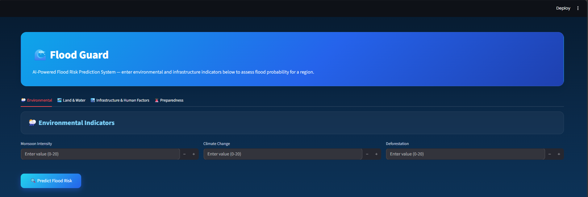
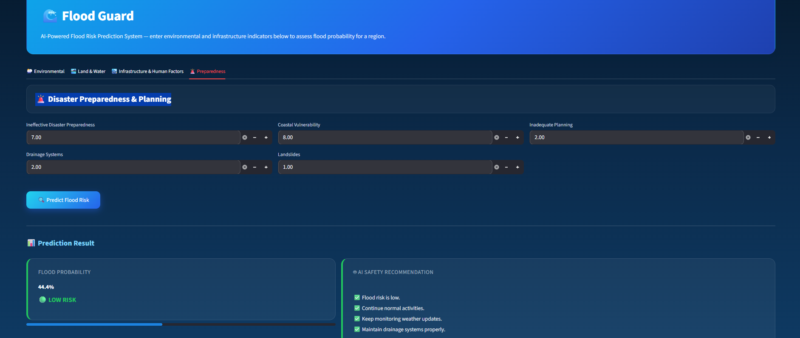
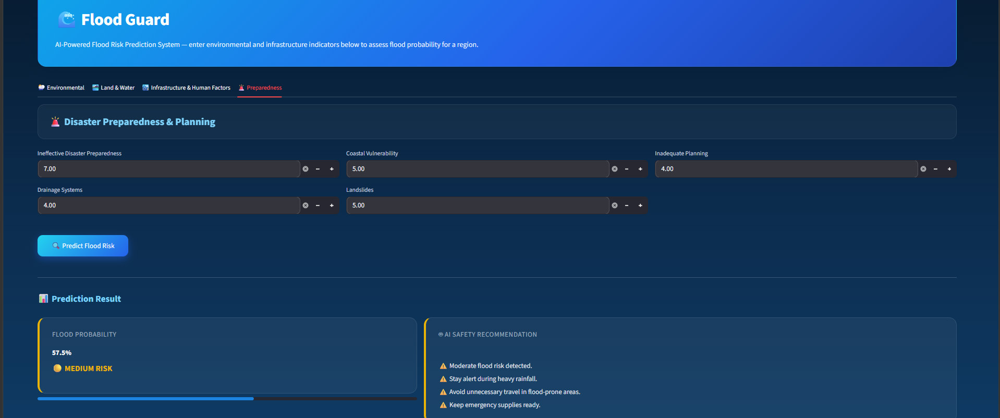
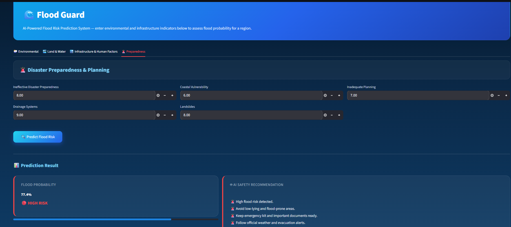

# 🌊 Flood Guard – AI-Powered Flood Risk Prediction System

An end-to-end Machine Learning project that predicts flood probability using environmental and infrastructure factors. The system is built using **XGBoost** and deployed with an interactive **Streamlit** web application that provides flood risk assessment and AI-based safety recommendations.

## Features

- Predicts flood probability using an XGBoost regression model.
- Evaluates flood risk as Low, Medium, or High.
- Provides AI-based safety recommendations based on predicted risk.
- Interactive web application built with Streamlit.
- Trained and evaluated using multiple machine learning models.
- Includes complete data preprocessing, EDA, and model comparison.

## Technologies Used

| Category | Technologies |
|----------|--------------|
| Programming Language | Python |
| Data Processing | Pandas, NumPy |
| Data Visualization | Matplotlib |
| Machine Learning | Scikit-learn, XGBoost, Random Forest |
| Model Deployment | Streamlit |
| Model Serialization | Joblib |
| Development Environment | Google Colab, PyCharm |
| Version Control | Git, GitHub |

## Dataset

The project uses a flood prediction dataset containing **50,000 records** and **20 input features** related to environmental, geographical, and infrastructure conditions.

### Input Features

- Monsoon Intensity
- Topography Drainage
- River Management
- Deforestation
- Urbanization
- Climate Change
- Dams Quality
- Siltation
- Agricultural Practices
- Encroachments
- Ineffective Disaster Preparedness
- Drainage Systems
- Coastal Vulnerability
- Landslides
- Watersheds
- Deteriorating Infrastructure
- Population Score
- Wetland Loss
- Inadequate Planning
- Political Factors

### Target Variable

- Flood Probability

## Project Workflow

The project follows a complete end-to-end machine learning workflow:

1. Data Collection
2. Data Preprocessing
   - Missing value handling
   - Outlier treatment
3. Exploratory Data Analysis (EDA)
4. Correlation Analysis
5. Feature Selection
6. Train-Test Split
7. Model Training
   - Random Forest Regressor
   - XGBoost Regressor
8. Model Evaluation
9. Model Comparison
10. Streamlit Deployment

---

## Model Performance

Two machine learning models were trained and evaluated.

| Model | Purpose |
|--------|----------|
| Random Forest Regressor | Baseline model |
| XGBoost Regressor | Final selected model |

### Evaluation Metrics

- Mean Absolute Error (MAE)
- Mean Squared Error (MSE)
- Root Mean Squared Error (RMSE)
- Mean Absolute Percentage Error (MAPE)
- R² Score

XGBoost achieved the best overall performance and was selected as the final model for deployment.

---

## Streamlit Application

The project includes an interactive Streamlit web application where users can:

- Enter environmental and infrastructure parameters
- Predict flood probability
- View flood risk category
- Receive AI-based safety recommendations

---
## Application Screenshots

### Home Page



### Low Risk Prediction



### Medium Risk Prediction



### High Risk Prediction



## Project Structure

```text
Flood-Guard-AI/
│
├── app.py
├── Flood_Guard.ipynb
├── flood_guard_model.pkl
├── flood.csv
├── requirements.txt
├── README.md
└── .gitignore
```

---

## Installation

1. Clone the repository.
2. Install the required dependencies.

```bash
pip install -r requirements.txt
```

3. Run the application.

```bash
streamlit run app.py
```

---

## Future Enhancements

- Integration with live weather APIs
- Interactive flood risk maps
- SMS/Email flood alerts
- Cloud deployment
- Mobile application support

---

## Author

**Thanha Shajahan**

Integrated MCA Graduate

Passionate about Machine Learning, Data Analytics, and AI-powered applications.